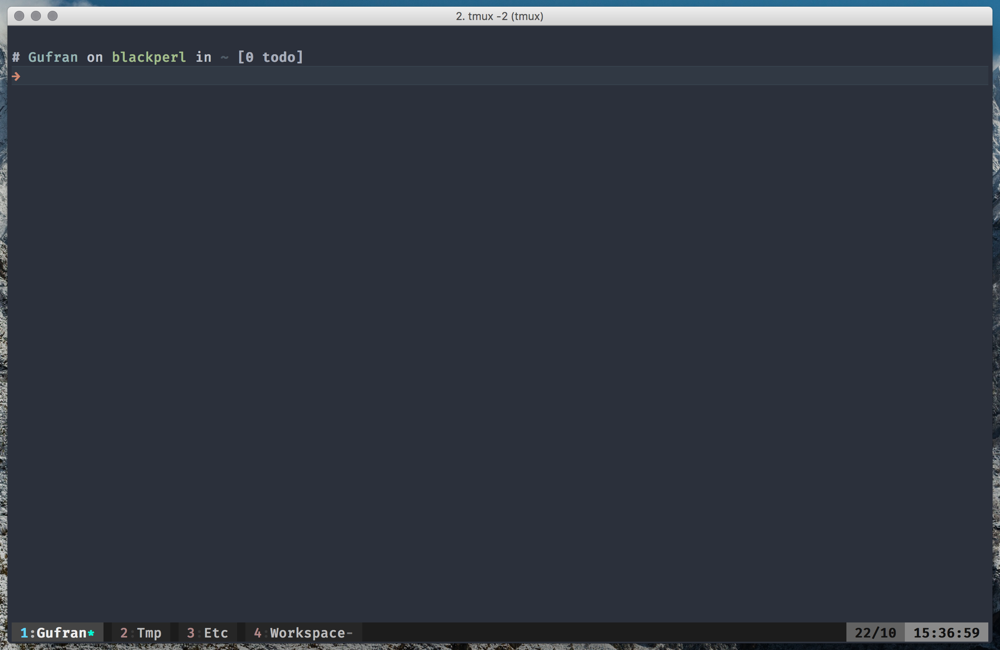

# Terminal configuration

This repository contains my terminal configuration and color schemes. Here is what it looks like.



# Install

Clone this repository on your machine and switch to it.

```sh
cd ~
git clone https://github.com/Gufran/Configurations .configuration
cd .configuration
```

Now you can install it either by executing `install.sh` script:

```sh
bash install.sh
```

or by manually creating symlinks:

```sh
ln -s "$pwd/tmux.conf" "$HOME/.tmux.conf"
ln -s "$pwd/zshrc" "$HOME/.zshrc"
ln -s "$pwd/zsh-colors.zsh.theme" "$HOME/.oh-my-zsh/themes/honukai.zsh-theme"
```

If you choose to run the install script, any existing configuration file which needs to be replaced
will be moved to a .bak file.

### iTerm color scheme

I have a slightly (?) modified version of [honukai][honukai] color scheme. If you like this version
then open iTerm preferences, go to Profiles > Colors and select Import from color presets dropdown.
Browse to the colorscheme present in this directory and load it.

Done.
